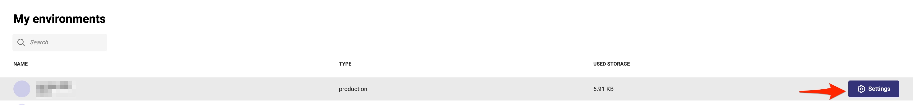
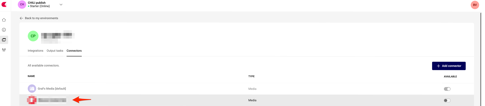
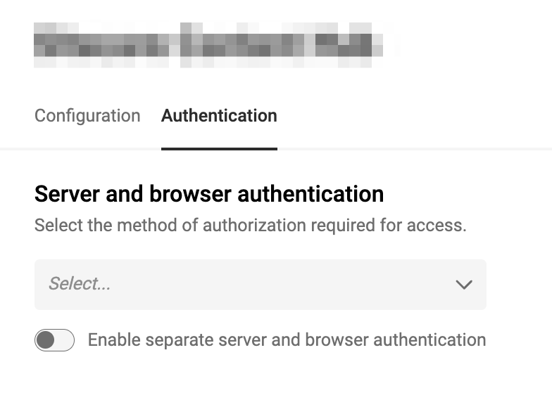
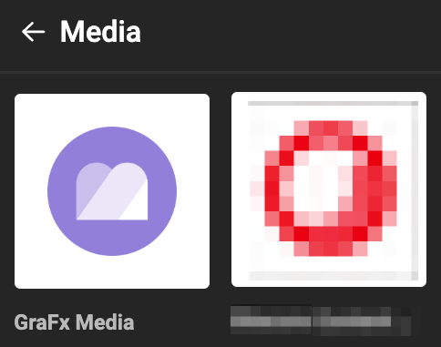
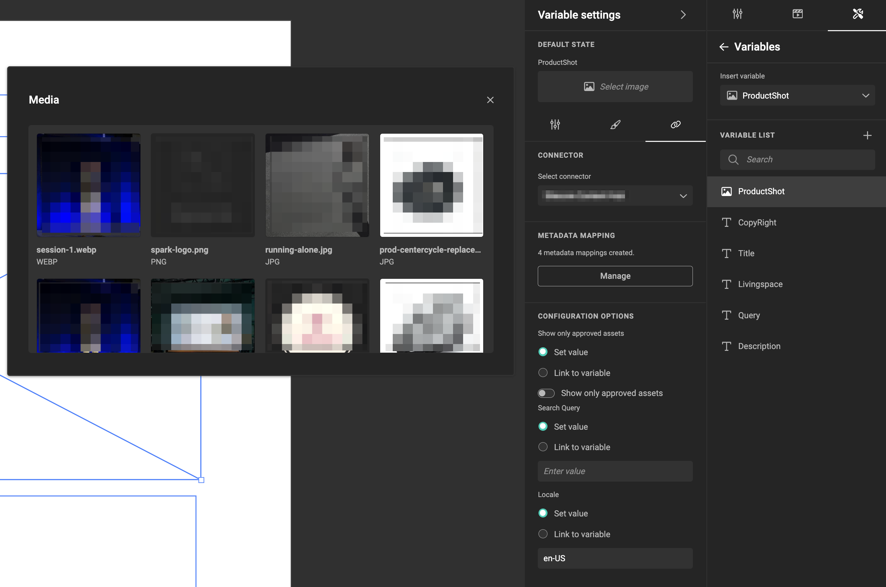

# Media Connector for Canto

|  | Connector Type |
| --- | --- |
|  | Built-in |
|  | Built by CHILI publish |
| :fontawesome-regular-square-check: | Third party |

[See Connector Types](/GraFx-Studio/concepts/connectors/#types-of-connectors)

## Support

Please open a issue on the connectors [github](https://github.com/spicy-labs/canto-media-connector/issues) page.

## Installation

How to deploy or install a connector to your environment?

[See Installation Through Connector Hub](/GraFx-Studio/guides/connector-hub/)

## Canto Media Connector Configuration 

!!! info
    Add the necessary references to settings that need to be made on the X-Y-Z side

Consult your [Canto API documentation](https://api.canto.com/) or Canto System Admin to obtain the correct values for the fields.

- **OAuth settings**
``` html
https://api.canto.com/#canto-oauth-page
```

## CHILI GraFx Connector Configuration 

From the overview of Environments, click on "Settings" on the right to your environment, where you want to install or configure the Connector.



Then click the installed Connector to access the configuration.



### Base Configuration

Your instance of the Connector needs to know which **Canto** instance it should communicate with and how to authenticate.


### Authentication

Select your type of authentication:

**Supported on Server:** OAuth 2.0 Client Credentials 

**Supported on Browser:** OAuth 2.0 Client Credentials



- **Client ID** and **Client Secret**: These are customer-specific credentials provided by the **Canto** Admin when creating integrations within **Canto**.
- **Username** and **Password**: User-specific credentials for authentication.
- **Token Endpoint**: Developer-oriented settings available in **X-Y-Z** documentation. These settings are generic for all **X-Y-Z** clients.
- **Scope**: Consult your **X-Y-Z** Admin to determine the appropriate scope.

You can configure separate authentication for machine-to-machine and browser use cases or use the same setup for both.

Consult your **Canto** System Admin for assistance in configuring these fields.

### Server Authentication

The credentials used for machine-to-machine authentication determine the governance on assets in automation workflows. 

This means that if the credentials restrict access to specific assets, only those assets will be available during batch processing.

### Browser Authentication or Impersonation

GraFx Studio accesses assets available in your Media Provider via impersonation, where the credentials configured for the connector determine which assets are visible to the user in the template.

**Impersonation** is the process of granting GraFx Studio users access to the DAM system using pre-configured credentials. This ensures seamless integration while respecting the DAM's security and governance rules.

## Using Assets from Your **Canto** System

### Place Assets in Your Template

- Select the **Canto** Connector.


  

Note that the current version of the Canto GraFx Media Connector does not currently support pulling in PDFs as image assets due to limitations within Canto.

### Image Variables

When using [image variables](/GraFx-Studio/guides/template-variables/assign/#assign-template-variable-to-image-frame), you will see the same list of assets when selecting an image.



### Configuration Options

#### Introduction

To filter the assets suggested to template users, you can use tags, keywords, or other search parameters (see the **Filter View** section below)  

**Canto** supports search queries through its query language. Consult the [**Canto API** Documentation](https://api.canto.com) or your **Canto** Administrator for guidance.  

### Folder view
This can be toggled on and off with the "Folder View" boolean value in the Connector options:  
  

When enabled, you can browse through folders and albums within the Canto environment to find the media asset you want.  


### Filter view
When the "Folder View" boolean value is toggled to false, the Connector will be in filter view mode. While here, there are a number of ways you can filter assets.

The "Keyword filter" configuration option:  
  
Will perform a keyword search across the Canto environment. This acts as a general search, similar to the search functionality within Canto itself.  

The "Tag filter" configuration option:  
  
Will filter assets based on the supplied tag value.  

Both of the above configuration options allow for any values that Canto's API allows, for example a Keyword search of "Beach|Office" would return anything with a keyword of "Beach" or "Office".  

The "Album filter" option:  
  
Will filter based on specific Albums within the Canto environment. This takes Canto Album IDs, _not_ album names (i.e. IUO3O, T36LE, or N3GIN).  
You can also add multiple Album IDs to this field, separated by a `&` character, to search in multiple albums at the same time, for example:  
  

The "Only show approved" option:  
  
Is a boolean field that allows you to hide any assets that aren't marked as `approved` within Canto.  

The "Fail Loading and Output if not approved" configuration option:  
  
Will add an extra check to disallow images loading, and make GraFx Studio outputs fail, if they aren't marked as `approved` within Canto.  

For more dynamic queries, you can use [variables](/GraFx-Studio/concepts/variables/), [actions](/GraFx-Studio/concepts/actions/), and [GraFx Genie](/GraFx-Studio/concepts/grafx-genie/) to automate and refine your queries.
