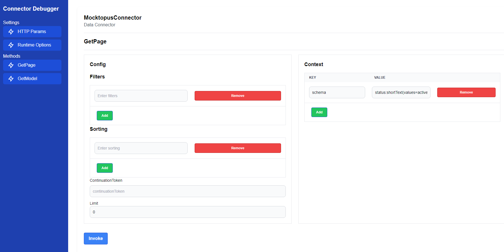

<div align="center">
  
</div>

# Mocktopus

A many-tentacled connector that pretends to connect to everything but actually connects to nothing.

Mocktopus generates fake data from a declarative schema DSL — useful for testing Studio templates without a real data source.

## Schema DSL

Define a schema using a comma-separated list of fields with their types and optional parameters. Each field is specified as `fieldName:type` or `fieldName:type(param1=value1,param2=value2)`.

Example:
```
firstName:shortText, age:number(min=0,max=100), active:boolean, joinDate:date
```

### Common parameters

Any field type can use the `values` parameter to pick a random value from a pipe-delimited list:
- **values**: Pipe-delimited list of values to randomly select from
  - Example: `status:shortText(values=active|inactive|pending)`, `priority:number(values=1|2|3|5)`

### Available field types and parameters:

- **shortText**: Generates short mock text (1-2 words)
  - `numberOfWords`: Number of words to generate (default: 2)
  - Example: `title:shortText(numberOfWords=3)`

- **longText**: Generates longer mock text (multiple sentences and paragraphs)
  - `numberOfParagraphs`: Number of paragraphs to generate (default: 2)
  - Example: `description:longText(numberOfParagraphs=3)`

- **number**: Generates numbers within a range
  - `min`: Minimum value (default: 0)
  - `max`: Maximum value (default: 1000)
  - Example: `age:number(min=18,max=100)` or `score:number(min=0,max=100)`

- **boolean**: Generates random true/false values
  - No parameters
  - Example: `active:boolean`

- **date**: Generates random dates between 2020-01-01 and 2030-01-01
  - No parameters
  - Example: `joinDate:date`

- **list**: Returns a single value picked from a pipe-delimited list, or a single random word if no list is provided
  - `values`: Pipe-delimited list of values to randomly select from
  - Example: `status:list(values=active|inactive|pending)`

- **image**: Generates identifiers which can be used by media connectors
  - Example: `photo:image`, `banner:image(values=Identifier1|Identifier2)`

## Configuration options

When using the connector, you provide these configuration parameters:

- **schema** (required): Defines the fields and types to generate. Uses the DSL described above.
  - Example: `firstName:shortText, age:number(min=18,max=100), active:boolean`

- **recordCount**: Number of records to generate (default: 10)
  - Example: `100`

- **simulateDelays**: Whether to add random delays to simulate a real data source (default: false)
  - Example: `true`

- **minDelay**: Minimum delay in milliseconds when `simulateDelays` is enabled (default: 100)
  - Example: `500`

- **maxDelay**: Maximum delay in milliseconds when `simulateDelays` is enabled (default: 1000)
  - Example: `3000`

## Generating a schema from a GraFx template

`ConvertTemplateToSchema.ps1` reads the `variables` array from a GraFx template JSON file and outputs a schema string ready to paste into the connector's **Schema** configuration field.

### Requirements

PowerShell 7+ (`pwsh`).

### Usage

```powershell
.\ConvertTemplateToSchema.ps1 -TemplatePath .\template.json
```

**Parameters**

| Parameter | Required | Description |
|---|---|---|
| `-TemplatePath` | Yes | Path to the GraFx template JSON file |
| `-OutputPath` | No | If supplied, also writes the schema string to this file |
| `-IncludeReadonly` | No | Include variables marked `isReadonly: true` (skipped by default) |
| `-ExcludeInvisible` | No | Skip variables whose visibility is not `visible` |

**Examples**

```powershell
# Basic usage — prints the schema to the terminal
.\ConvertTemplateToSchema.ps1 -TemplatePath .\template.json

# Save the output to a file and include readonly variables
.\ConvertTemplateToSchema.ps1 -TemplatePath .\template.json -OutputPath .\schema.txt -IncludeReadonly
```

The script maps GraFx variable types (`shortText`, `longText`, `number`, `boolean`, `date`, `list`, `image`) directly to Mocktopus DSL types. Variables with unrecognised types are skipped with a warning.

## Local development

Prerequisites: [Docker Desktop](https://www.docker.com/products/docker-desktop/)

### First-time setup

Build the image once (this installs all dependencies inside the image):

```bash
docker-compose build
```

### Start a shell in the container

```bash
docker-compose run -p 3300:3300 cli sh
```

This drops you into a shell with `connector-cli` available and the connector source mounted at `/connector`. Dependencies are provided by the image — no local `npm install` needed.

### Build

```bash
connector-cli build
```

### Manual testing

```bash
connector-cli debug -p 3300 -w
```

Open the debug UI at http://localhost:3300/?type=DataConnector. Add a `schema` parameter with a value like: `status:shortText(values=active|inactive|pending), priority:number(values=1|3|5)`.

Click **Add** to create the parameter, then **Invoke** to test the connector. This generates mock data according to your schema:



### Publish to a GraFx environment

```bash
# Authenticate once (token is stored in a named Docker volume)
connector-cli login

# Deploy
connector-cli publish -b https://<your-environment>.chili-publish.online/grafx -e <environment-name> -n Mocktopus --proxyOption.allowedDomains ""
```

The `connector-auth` Docker volume persists the login token between sessions so you only need to run `login` once.
